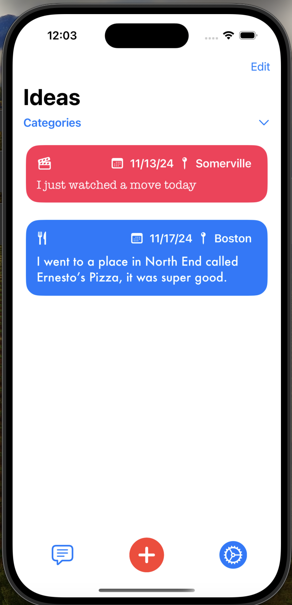
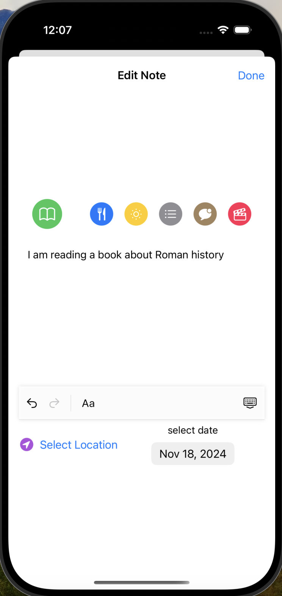

HomeScreen:


Editor View:


# Write-It-Down App

Write-It-Down is a SwiftUI-based note-taking application designed to help users capture ideas, thoughts, and memories effortlessly. The app features rich text editing, image support, and location tagging, providing a versatile platform for creative expression and daily organization.

## Features

- **Rich Text Editing:** Customize your notes with different fonts, sizes, and colors using an intuitive text editor.
- **Location Tagging:** Automatically tag notes with your current location or manually set a location.
- **Category Organization:** Organize notes under customizable categories for easy browsing.
- **Reordering & Deletion:** Drag and drop to reorder notes or delete them effortlessly.


## Working Log

### 2024-11-18
- UI updates, new category selection functionality
- Map View in Location Picker

### 2024-10-22 - CoreData Integration
  - Integrated the application with CoreData for data persistence
  - Now the data is managed by DataController that is a NSManagedObjectContext

### To be implmented:
- [] Allow filtering / selection based on note attributes (type, date, etc.)
- [] Add automatic location detection to LocationPicker
- [] UI changes (add more symbols / colors in settings)

## Installation

1. Clone the repository:
   ```bash
   git clone https://github.com/username/write-it-down.git
